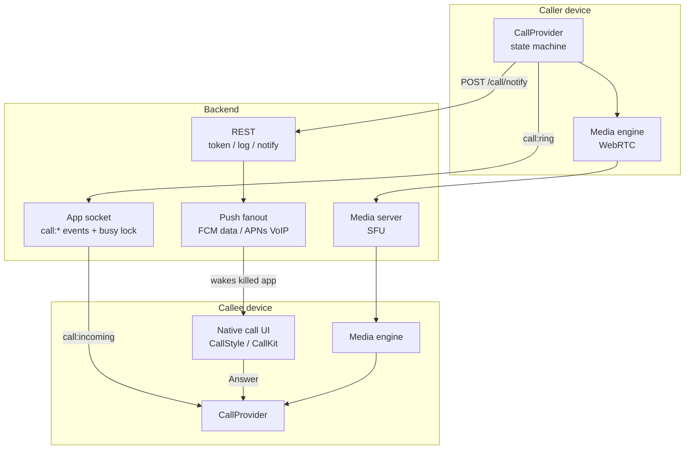
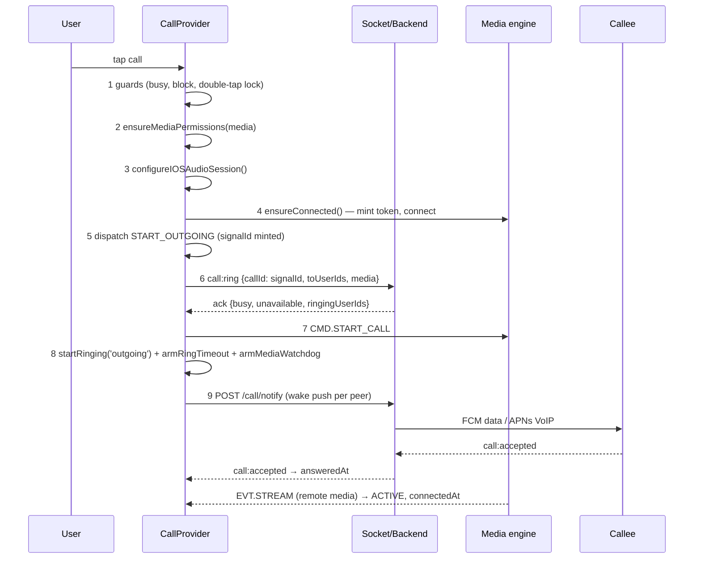
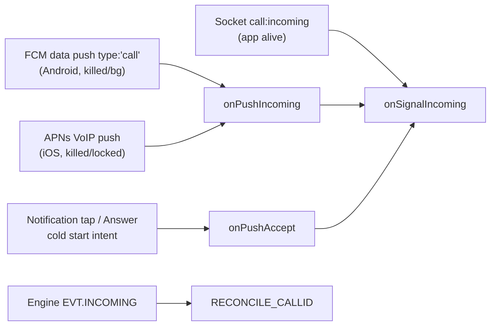

# Voice & Video Call Feature — Complete Implementation Guide

A port-ready specification of the whole calling stack: how a call connects, how ringing
is presented, how the duration timer works, every Android and iOS native module, the
call banners, and what happens when the app is backgrounded, killed, or the screen is
locked.

Read this top-to-bottom once, then use §21 as the build order.

> **Source of truth.** Every rule below is taken from working code. File references are
> given so you can diff against the original implementation.

---

## Table of contents

1. [Architecture at a glance](#1-architecture-at-a-glance)
2. [The two-ID model (critical)](#2-the-two-id-model-critical)
3. [File map](#3-file-map)
4. [Call state machine](#4-call-state-machine)
5. [Outgoing call — step by step](#5-outgoing-call--step-by-step)
6. [Incoming call — four delivery paths](#6-incoming-call--four-delivery-paths)
7. [Ringing: who rings, and with what](#7-ringing-who-rings-and-with-what)
8. [Accept flow (and the pendingAccept race)](#8-accept-flow-and-the-pendingaccept-race)
9. [Connect → ACTIVE, and where duration starts](#9-connect--active-and-where-duration-starts)
10. [Duration timers — all four of them](#10-duration-timers--all-four-of-them)
11. [Ending a call: finalizeEnd](#11-ending-a-call-finalizeend)
12. [Timeouts & watchdogs reference](#12-timeouts--watchdogs-reference)
13. [Android native module (expo-call-ui)](#13-android-native-module-expo-call-ui)
14. [Android config plugins](#14-android-config-plugins)
15. [iOS native: CallKit + PushKit](#15-ios-native-callkit--pushkit)
16. [Call banners & in-app surfaces](#16-call-banners--in-app-surfaces)
17. [App closed / killed / locked — behaviour matrix](#17-app-closed--killed--locked--behaviour-matrix)
18. [Backend contract](#18-backend-contract)
19. [Permissions](#19-permissions)
20. [Audio routing & audio session](#20-audio-routing--audio-session)
21. [Porting checklist (build order)](#21-porting-checklist-build-order)
22. [Hard-won gotchas](#22-hard-won-gotchas)

---

## 1. Architecture at a glance

There are **three independent transports**, and you need all three. Any one of them
alone produces a call feature that "works on my phone" and fails in the field.



| Transport | Purpose | Works when app is… |
|---|---|---|
| **App socket** (`call:*`) | Signaling truth: ring, accept, reject, end, busy lock, timeout, multi-device dismissal | foreground / background with a live socket |
| **Push** (FCM data on Android, APNs **VoIP** on iOS) | Wakes a **killed** device so it can ring at all | killed, force-stopped, Doze, locked |
| **Media engine** (WebRTC ↔ SFU) | Actual audio/video, and its own `incoming`/`stream`/`ended` events | connected only |

**Design rule:** the socket is the *authority*, the push is the *wake-up*, the engine is
the *media*. Never derive call lifecycle from the engine alone — a killed app has no
engine.

### Media engine is swappable

`src/calls/engineSelector.js` picks between two engines behind **one identical command
protocol** (`src/calls/engine/protocol.js`):

- **WebView engine** — a browser calling SDK hosted in a `WKWebView`/Android WebView.
  Commands go in via `injectJavaScript`, events come out via `postMessage`.
- **Native engine** — `react-native-webrtc` + `mediasoup-client`, no WebView.

```js
export const CALL_NATIVE_ENGINE_IOS = true;
export const CALL_NATIVE_ENGINE_ANDROID = false;
export const isNativeCallEngine = () =>
  (CALL_NATIVE_ENGINE_IOS && Platform.OS === 'ios')
  || (CALL_NATIVE_ENGINE_ANDROID && Platform.OS === 'android');
```

Because both implement the same `CMD`/`EVT` surface, flipping the flag is the entire
rollback story. **If you are building fresh, use native WebRTC on both platforms** — see
§15 for why a WebView engine and CallKit fight over the iOS audio session.

The only seam is `sendCmd`:

```js
const sendCmd = useCallback((msg) => {
  if (isNativeCallEngine()) { nativeEngine.cmd(msg); return; }
  webRef.current?.injectJavaScript(buildCmdInjection(msg));
}, []);
```

---

## 2. The two-ID model (critical)

This trips up every port. **A call has two different ids at the same time.**

| Id | Minted by | Format | Used for |
|---|---|---|---|
| **`signalId`** | The caller, locally, at dial time | `sig_<callerId>_<epochMs>` | App socket `call:*` events, busy lock, push payloads, notification ids, **the call-log row**, CallKit/CallStyle keying |
| **`callId`** | The media server, when the WebRTC call is created | opaque | `CMD.ACCEPT` / engine-level operations only |

```js
const signalId = `sig_${myId || 'me'}_${Date.now()}`;
```

Rules that fall out of this:

- The **call log always uses `signalId`** — it is the only id both parties share.
  Logging with the engine `callId` makes the same call appear as two rows.
- Notifications are posted keyed on `signalId`, so **cancel by "all shown call
  notifications", never by the live state's id** — the state may have settled on the
  engine `callId` by then.
- Ending a native call ends **both** ids, then sweeps all:
  ```js
  if (snap.callId)   nativeCall.endCall(snap.callId, ckEndedReason);
  if (snap.signalId) nativeCall.endCall(snap.signalId, ckEndedReason);
  nativeCall.endAllCalls();   // kill any ghost from a uuid split
  ```
- The `signalId` embeds the dial time. That is the **only** timing signal a replayed
  notification tap carries, and it is what lets you drop a stale ring (§6.5).

On iOS there is a **third** id: the CallKit `UUID` (RFC 4122). The backend mints one
stable uuid per call and sends it in the VoIP push; JS binds it with
`registerCallUuid(callId, uuid)` so both paths converge on one CallKit call.

---

## 3. File map

```
src/calls/
├── CallProvider.jsx          ← the orchestrator (everything below is wired here)
├── CallContext.js            ← leaf context module (breaks the require cycle)
├── useCall.js                ← consumer hook
├── engineSelector.js         ← WebView vs native WebRTC kill-switch
├── state/
│   └── callMachine.js        ← pure reducer: statuses, actions, roster, outcome
├── engine/
│   ├── protocol.js           ← CMD / EVT vocabulary (RN ↔ engine)
│   ├── CallEngineWebView.jsx
│   └── callEngineHtml.js     ← the browser-SDK glue page
├── native-engine/            ← react-native-webrtc implementation of the same protocol
│   ├── NativeCallEngine.js
│   ├── NativeCallingSDK.js
│   ├── NativeVideoStage.jsx
│   └── AudioRoute.js         ← react-native-incall-manager wrapper (BOTH engines use it)
├── services/
│   ├── callSignalService.js  ← app-socket call:* emit/listen
│   ├── callTokenService.js   ← GET /call/token (+ ring duration, ICE, recording cfg)
│   ├── callNotifyService.js  ← POST /call/notify (wake push)
│   ├── nativeCallService.js  ← CallKit bridge (react-native-callkeep), iOS-gated
│   ├── voipPushService.js    ← PushKit token + push→ring (iOS)
│   ├── ringtoneService.js    ← in-app ringtone / ringback
│   ├── callLogService.js     ← POST /call/log, history CRUD
│   └── missedCallBadge.js
├── screens/
│   └── CallOverlay.jsx       ← the full-screen call UI
└── components/
    ├── CallMiniBanner.jsx    ← minimized VOICE call top bar  (+ MINI_BAR_HEIGHT)
    ├── CallContentInset.jsx  ← pushes the navigator down by the banner height
    ├── IncomingCallBanner.jsx← compact incoming heads-up (currently disabled)
    ├── ColdStartCallCover.jsx← instant cover on a killed+locked launch
    ├── CallTimer.jsx         ← the in-app duration ticker
    ├── useDraggablePip.js    ← floating video PiP drag
    └── CallReliabilityGate.jsx ← OEM battery/autostart onboarding

src/firebase/
├── callEvents.js             ← CALL_PUSH_EVENTS + staleness helpers  (dependency-free)
├── callNotifee.js            ← Android notification backends + lock-screen helpers
└── fcmService.js             ← FCM foreground/background handlers

modules/expo-call-ui/         ← the Android native module (Kotlin)
├── index.ts
└── android/src/main/java/expo/modules/callui/
    ├── ExpoCallUiModule.kt      ← CallStyle notification, keyguard, OEM settings
    ├── CallForegroundService.kt ← ongoing-call FGS + duration chronometer
    └── CallActionReceiver.kt    ← Decline / Hang-up broadcast receiver

plugins/
├── withCallFullScreen.js     ← USE_FULL_SCREEN_INTENT + showWhenLocked
├── withCallFcmService.js     ← native FirebaseMessagingService subclass
├── withCallOnNewIntent.js    ← MainActivity.onNewIntent → setIntent()
└── withIosVoip.js            ← aps-environment, background modes, PushKit AppDelegate
```

---

## 4. Call state machine

`src/calls/state/callMachine.js` is a **pure reducer** — no side effects, fully
testable. This is the single most portable file in the stack.

### Statuses

```
idle → outgoing → active → ended → idle
idle → incoming → active → ended → idle
```

`ENDED` is a real, visible state (it holds the "Call declined" / "Missed" message) that
auto-resets to `IDLE` after a delay.

### State shape (the fields that matter)

| Field | Meaning |
|---|---|
| `status` | one of the five above |
| `callId` | engine/WebRTC id |
| `signalId` | app-socket signaling id |
| `awaitingEngine` | ringing was staged from the socket; engine id still pending |
| `pendingAccept` | user accepted before the engine id arrived |
| `incomingExpanded` | compact banner → full-screen ring screen |
| `notificationOnly` | present this ring **only** via the OS notification |
| `peer` / `peers` / `participants` | 1:1 party / invited list / live roster |
| `isGroup` / `isConference` / `hostId` | multi-party mode |
| `media` | `'audio'` \| `'video'` |
| `direction` | `'incoming'` \| `'outgoing'` |
| `micOn`, `cameraOn`, `speakerOn`, `screenSharing`, `facingMode` | control flags |
| `minimized` | shrunk to banner (voice) or PiP (video) |
| `accepted` | user tapped Accept — **media may still be connecting** |
| `remoteJoined` | remote media has arrived |
| `reconnecting` | mid-call media drop; "Reconnecting…" |
| `startedAt` | dial / ring arrival |
| `answeredAt` | Accept tapped (callee) or accept signal received (caller) |
| **`connectedAt`** | **first real remote media — the timer counts from here** |
| `endedAt`, `endReason`, `errorMessage` | terminal info |

### The three time stamps — do not collapse them

```
startedAt ──────► answeredAt ──────► connectedAt
  dial/ring         Accept tap        remote media (ICE/DTLS done)
                    ↑                 ↑
             "Connecting…"      timer starts HERE
```

The `answeredAt → connectedAt` gap is 1–8s on weak networks. Billing or displaying it
as talk time is what makes users say "the call showed 0:07 but I heard nothing."

### Actions

`START_OUTGOING`, `OUTGOING_CONFIRMED`, `INCOMING`, `RECONCILE_CALLID`, `SET_SIGNAL`,
`ACCEPT`, `REMOTE_JOINED`, `PARTICIPANT_JOINED/INVITED/LEFT/REMOVED`, `ACTIVE_SPEAKER`,
`CONFERENCE_SYNC`, `SET_FLAG`, `CAMERA_CHANGED`, `NEEDS_UNMUTE`, `ENDED`, `RESET`.

Two reducer rules worth copying verbatim:

**Duplicate-INCOMING merge.** The socket `call:incoming` and the engine `incoming`
land within milliseconds of each other. Dropping the second one loses the engine
`callId` and hangs Accept on `pendingAccept` forever. So *merge* instead:

```js
if (state.status === CALL_STATUS.INCOMING
    && !isGroup && !state.isGroup
    && action.peer && state.peer
    && String(action.peer.id) === String(state.peer.id)) {
  const mergedCallId = state.callId || action.callId || null;
  return { ...state, callId: mergedCallId,
           signalId: state.signalId || action.signalId || null,
           awaitingEngine: mergedCallId ? false : state.awaitingEngine };
}
if (state.status !== IDLE && state.status !== ENDED) return state;  // busy → ignore
```

**Outcome derivation** — what gets written to the call log:

```js
export function deriveOutcome(state, reason) {
  const wasActive = !!state.answeredAt;
  if (reason === 'rejected')  return 'rejected';
  if (reason === 'cancelled') return 'cancelled';
  if (reason === 'failed')    return 'failed';
  if (reason === 'missed')    return 'missed';
  if (wasActive)              return 'completed';
  return state.direction === 'outgoing' ? 'cancelled' : 'missed';
}
```

---

## 5. Outgoing call — step by step

`CallProvider.startCall(peerOrPeers, media, opts)`



### The guards, in order

```js
// 1. dedupe/blocking
if (blk.iBlocked)  return Alert('You blocked this contact');
if (blk.blockedMe) return Alert("You can't call this contact");
if (state.status !== IDLE && state.status !== ENDED) return;

// 2. SYNCHRONOUS double-tap lock — the async guards above still read IDLE
//    during the permission/connect await window
if (startingRef.current) return;
startingRef.current = true;
setStarting(true);      // dims every call button app-wide via `callBusy`
try { /* … */ } finally { startingRef.current = false; setStarting(false); }
```

### The ring ack decides the outcome

`call:ring` resolves with `{ ok, busy, busyUserIds, ringingUserIds, unavailable,
unavailableMessage, glare }`, or optimistically as *not busy* after a **4s** ack
timeout so an old/offline server never blocks the call.

| Ack | Result |
|---|---|
| `busy` (and, for a group, nobody ringing) | end with `'busy'`; if `glare` (mutual dial) show *"They are calling you — answer their call"* |
| `unavailable` | end with `'failed'` + the server's reason (logged out / deactivated / blocked) — **abort before the WebRTC dial** so you never ring into the void |
| otherwise | proceed to `CMD.START_CALL` |

### Abort correctness

After awaiting the ack you must check a **synchronous** `endedRef`, not
`state.status` — on a fast LAN server the ack returns before React commits
`START_OUTGOING`, so `status` still reads `idle` and you would falsely abort the real
dial:

```js
if (endedRef.current) {
  cancelCall({ callId: signalId, toUserIds: peerIds }); // re-send; server-side is idempotent
  return;
}
```

### Wake push

```js
peers.forEach((p) => notifyIncomingCall({ peerId: p.id, media, callId: signalId }));
```

`POST /call/notify` is belt-and-braces on top of the server's own `call:ring` fanout.
Both key the push on the same `signalId`, so duplicates collapse into one notification.

---

## 6. Incoming call — four delivery paths

All four converge on **one function**: `onSignalIncoming(payload, opts)`.



### 6.1 Socket path (app alive)

`registerCallSignalListeners` attaches on every socket (re)connect:

```
call:incoming · call:cancelled · call:accepted · call:rejected · call:ended
call:unavailable · call:timeout · call:cancelled-elsewhere
call:conference:{converted,roster,participant:*,host:changed,ended}
```

### 6.2 Android FCM data push (killed / background)

Two renderers race, and the **native one wins**:

1. **`CallMessagingService`** (generated by `plugins/withCallFcmService.js`) — a
   Kotlin `FirebaseMessagingService` that **subclasses react-native-firebase's own
   service** (so token refresh and normal delivery are preserved by inheritance) and,
   on `data.type === "call"`, posts the CallStyle notification **natively in
   ~100–200 ms**, before the JS runtime boots.
2. The JS `setBackgroundMessageHandler` also runs and re-renders the same
   `callId.hashCode()` notification — a refresh, never a duplicate.

Registered with a higher intent-filter priority than RNFirebase's so FCM binds ours:

```xml
<service android:name=".CallMessagingService" android:exported="false">
  <intent-filter android:priority="1">
    <action android:name="com.google.firebase.MESSAGING_EVENT"/>
  </intent-filter>
</service>
```

It also handles `type:"call_cancel"` natively (`ExpoCallUiModule.cancelIncoming`) so a
killed callee's ringing notification clears instantly.

### 6.3 iOS VoIP (PushKit)

APNs VoIP push → `AppDelegate.pushRegistry(_:didReceiveIncomingPushWith:)` →
`RNCallKeep.reportNewIncomingCall(...)` **synchronously** (iOS 13+ kills the app if a
VoIP push does not report a call in the same run loop) → then forwards to JS, which
emits `CALL_PUSH_EVENTS.INCOMING` with `_voip: true` so JS does **not** report a second
CallKit call.

### 6.4 Cold start from the launch intent (Android)

The notification's Answer / full-screen / body PendingIntents are all
**`getActivity`** intents carrying extras. On boot:

- `peekInitialCallLaunch()` — **non-consuming** read → paints `ColdStartCallCover`
  from the first frame (no chat-list flash).
- `getInitialCallAction()` — **consuming** read → drives the real accept, fired only
  once authentication is restored (it needs the token mint).

> Answer must be `getActivity`, **not** `getBroadcast → startActivity`. Android 10+
> blocks background activity starts, which is why a broadcast-based Answer button
> silently fails to open the app.

### 6.5 Staleness: the three-tier push guard

A high-priority push can sit buffered under Doze and arrive as a **burst** when the
device wakes — ringing a dozen long-dead calls at once.

```js
STALE_CALL_PUSH_MS = 60_000;   // older than the ring window → certainly dead
AGED_CALL_PUSH_MS  = 12_000;   // maybe dead → verify with the server
```

| Age | Action |
|---|---|
| < 12s | ring immediately |
| 12–60s (**aged**) | dismiss the notification, `pullPendingCalls()` — the server is authoritative; a live invite re-rings via its `call:incoming` |
| > 60s (**stale**) | drop, cancel all call notifications, and on iOS `dismissIncoming()` the CallKit ring the AppDelegate was forced to report |

Age is read from the backend `data.ts`, falling back to the dial epoch embedded in
`signalId`:

```js
const callIdDialTime = (callId) => {
  const m = /_(\d{11,})$/.exec(String(callId || ''));
  return m ? Number(m[1]) : NaN;
};
```

That fallback is what stops "I tapped an old notification and a dead call started
ringing" — a replayed tap carries no `ts`.

### 6.6 What onSignalIncoming does

```js
stagedIncomingRef.current = { peerId: callerId, ts: Date.now() };  // engine-reconcile marker
dispatch({ type: ACT.INCOMING, signalId: payload.callId, awaitingEngine: true, … });

if (notificationOnly) {                 // Android, app foreground, not a fullscreen launch
  displayIncomingCallNotifee({...});    // the OS notification IS the whole ring UI
  armRingTimeout(); ensureConnected();  // warm the engine so Accept connects fast
  return;
}

const useCallKit = Platform.OS === 'ios' && nativeCall.isAvailable();
const appVisible = AppState.currentState === 'active';
if (!useCallKit && (Platform.OS !== 'android' || appVisible)) startRinging('incoming');
armRingTimeout();
lockedCallRef.current = isDeviceLockedNow() || deviceLockedRef.current;
ensureConnected();                       // wake the engine so its `incoming` can land
if (shouldExpand) dispatch({ SET_FLAG, incomingExpanded: true });
if (Platform.OS !== 'android' || appVisible) cancelAllIncomingCallNotifee();
if (backendCallUuid) nativeCall.registerCallUuid(payload.callId, backendCallUuid);
if (!opts.skipNativeUi) nativeCall.displayIncomingCall(...);   // iOS CallKit
```

Decision table for the ring surface:

| Platform | App state | Ring UI |
|---|---|---|
| iOS + CallKit | any | **CallKit** full-screen/banner (system ringtone). No in-app ring, no in-app ringtone. |
| iOS without CallKit | any | In-app full-screen `CallOverlay` (always expands — iOS has no native call UI) |
| Android | foreground, unlocked | `notificationOnly` → OS CallStyle heads-up only (product choice) |
| Android | backgrounded / screen-off / **locked** | OS CallStyle notification (its channel rings) + full-screen intent brings the activity up over the keyguard |

**Locked-device rule:** `lockedAtRing = isDeviceLockedNow() || deviceLockedRef.current`
is computed from lock signals **alone** — never `AppState === 'active'`. On a push wake
the INCOMING signal is routinely processed a tick *before* AppState commits, and the
race used to classify a locked call as notification-only, so the full-screen UI never
appeared.

---

## 7. Ringing: who rings, and with what

There are **three possible ring sounds**, and exactly one must play.

| Sound | Source | When |
|---|---|---|
| **In-app ringtone** (looping) | `ringtoneService.playRingtone()`, `expo-av` | Callee, app foreground, non-CallKit |
| **In-app ringback** (440+480 Hz double-ring) | `ringtoneService.playRingback()` | Caller, from dial until answer |
| **OS notification channel ringtone** | Android channel `calls_fullscreen_v2` / iOS CallKit | Callee, backgrounded/killed/locked |

```js
export const playRingtone = () => start(RINGTONE, 1.0);
export const playRingback = () => start(RINGBACK, 0.7);
```

Implementation details that matter:

- A monotonic `gen` token guards the async `createAsync()`: if `stop()` or a newer
  `start()` happened while a sound was loading, the stale sound is unloaded instead of
  looping forever. Without this, call → reject → call stacks tones.
- Audio mode: `playsInSilentModeIOS: true`, `shouldDuckAndroid: false`.
- Vibration accompanies the ring; the OS channel also carries
  `vibrationPattern = [0, 900, 700, 900]`.

### Ring handover (the subtle one)

On a locked/backgrounded Android ring, the **notification** is the ringing surface and
the in-app ringtone was deliberately never started. When the user brings the app up
mid-ring (full-screen intent / body tap), cancelling that notification silences its
ringtone — so you must start the in-app one **in the same beat**, or the ring goes mute
while the call is still incoming:

```js
const takeOver = () => {
  cancelAllIncomingCallNotifee();
  if (Platform.OS === 'android') startRinging('incoming');   // idempotent
};
if (AppState.currentState === 'active') takeOver();
AppState.addEventListener('change', (n) => { if (n === 'active') takeOver(); });
```

### Ring window

```js
const ENV_RING_SEC = parseInt(CALL_RING_DURATION_SECONDS, 10) || 35;
const clampRingSec = (s) => Math.min(Math.max(Number(s) || 0, 10), 180);
const getRingTimeoutMs = () =>
  clampRingSec(getServerRingDurationSec() || ENV_RING_SEC) * 1000;
```

The **backend value wins** (delivered with the call token) so both ends ring for the
same window; the app `.env` is only the fallback. The server also enforces its own ring
timer and emits `call:timeout` — the client timer only governs when *this app* stops
ringing.

---

## 8. Accept flow (and the pendingAccept race)

```js
const accept = async () => {
  if (snap.status !== INCOMING) return;

  // 1. STOP THE RING FIRST — before any await.
  clearRingTimeout();
  stopRinging();
```

> **Why first:** on a first-ever call the OS mic/camera dialog blocks the `await` below
> while the ring timeout keeps running and fires `missed` — the call auto-misses with
> the permission dialog still on screen, right as the user is about to grant it.

```js
  // 2. permissions (video with camera denied → answer as VOICE, don't decline)
  const permOk = await ensureMediaPermissions(snap.media);
  if (!permOk) { finalizeEnd('rejected', 'Permission denied'); return; }
  const effMedia = permOk === 'audio-fallback' ? 'audio' : snap.media;

  // 3. iOS: file CXAnswerCallAction so CallKit dismisses AND activates the audio
  //    session (without this an in-app accept leaves CallKit ringing over a
  //    "connected" call, with dead audio)
  if (Platform.OS === 'ios' && nativeCall.isAvailable())
    nativeCall.answerIncomingCall(snap.signalId || snap.callId);

  await configureIOSAudioSession();
  cancelAllIncomingCallNotifee();
  myAcceptedCallRef.current = { id: String(snap.signalId || snap.callId), ts: Date.now() };
  dispatch({ type: ACT.ACCEPT, nowMs: Date.now() });   // stamps answeredAt
  armConnectWatchdog();                                 // ring timer is gone; 30s net

  // 4. ACK-VERIFIED accept notify, detached (never blocks media)
  //    3 attempts, 900ms × attempt backoff
  //    ack.ended            → finalizeEnd (server tombstoned this call)
  //    ack.answeredElsewhere→ stop; another device won
  //    ack.callId === null  → server could NOT attribute → retry
  //                           (else the caller keeps hearing RINGING)

  // 5. engine may not be up yet (accept from a push/lock screen) — connect, retry once
  let ready = await ensureConnected();
  if (!ready) ready = await ensureConnected();
  if (!ready) { finalizeEnd('failed', 'Could not connect the call'); return; }

  // 6. answer if the engine id is known, else defer
  if (cur.callId) sendCmd({ cmd: CMD.ACCEPT, callId: cur.callId, media: effMedia,
                            speaker: wantSpeaker, isGroup, peerId });
  else dispatch({ type: ACT.SET_FLAG, key: 'pendingAccept', value: true });
};
```

### The pendingAccept flush must be an effect, not a callback

The engine `incoming` handler reads `stateRef`, which can be **one commit behind**:
`accept()` dispatches `pendingAccept` and the engine event lands in the *same tick*, so
the handler sees `pendingAccept: false`, never sends `CMD.ACCEPT`, and the callee sits
on "Connecting…" until the 30s watchdog kills the call.

Fix: a `useEffect` that runs **after** the commit and fires whenever an accepted call
has both the flag and the engine `callId`.

### Deferred accept from a cold start

```js
useEffect(() => {
  if (state.status !== INCOMING || state.accepted) return;
  if (nativeEndPendingRef.current) {        // CallKit End fired before INCOMING committed
    const fresh = Date.now() - nativeEndPendingRef.current < 45000;
    nativeEndPendingRef.current = 0;
    if (fresh) { pushAcceptPendingRef.current = false; reject(); return; }
  }
  if (pushAcceptPendingRef.current) { pushAcceptPendingRef.current = false; accept(); }
}, [state.status, state.accepted, accept, reject]);
```

`onPushAccept` sets `pushAcceptPendingRef` **only** on a cold start. If the app is
already ringing this call it calls `accept()` directly — the effect only re-runs on a
*change*, so arming the flag there would leave a stale flag that auto-accepts the
**next** call without a tap.

---

## 9. Connect → ACTIVE, and where duration starts

Only **real remote media** flips the call to `ACTIVE`:

```js
case ACT.REMOTE_JOINED:      // 1:1 — engine EVT.STREAM (ontrack)
case ACT.PARTICIPANT_JOINED: // group
  return { ...state,
    status: CALL_STATUS.ACTIVE,
    remoteJoined: true,
    answeredAt:  state.answeredAt  || action.nowMs,
    connectedAt: state.connectedAt || action.nowMs };   // ← timer origin
```

`accepted` is **never** enough. The UI derives:

```js
const mediaConnected = status === ACTIVE;
const connecting     = accepted && status !== ACTIVE && status !== ENDED;  // "Connecting…"
const timerRunning   = mediaConnected && status !== ENDED && !call.reconnecting;
```

A mid-call media drop (`EVT.MEDIA_DOWN`) sets `reconnecting: true` → the timer is
replaced by "Reconnecting…", and `RECONNECT_TIMEOUT_MS` (7s) ends the call if
`EVT.MEDIA_UP` never arrives. 7s is deliberately **longer** than the server's 5s
reconnect grace so the local watchdog never races a recovery the server was still
holding.

---

## 10. Duration timers — all four of them

They must all read from **`connectedAt`**, or they disagree.

| # | Surface | Implementation | Starts at |
|---|---|---|---|
| 1 | Full-screen `CallOverlay` | `<CallTimer startMs={connectedAt} />` — `setInterval` 1000 ms | `connectedAt` |
| 2 | Minimized voice `CallMiniBanner` | same `CallTimer` component | `connectedAt` |
| 3 | Video PiP overlay | same `CallTimer` | `connectedAt` |
| 4 | **Android ongoing notification** | native `setUsesChronometer(true)` + `setWhen(startedAtMs)` | `connectedAt` passed over the bridge |
| — | Call log `durationSec` | `Math.round((Date.now() - connectedAt) / 1000)` | `connectedAt` (falls back to `answeredAt` for old rows) |

```js
const fmt = (totalSec) => {
  const s = Math.max(0, Math.floor(totalSec));
  const h = Math.floor(s / 3600), m = Math.floor((s % 3600) / 60), sec = s % 60;
  const mm = h > 0 ? String(m).padStart(2, '0') : String(m);
  return h > 0 ? `${h}:${mm}:${String(sec).padStart(2,'0')}`
               : `${mm}:${String(sec).padStart(2,'0')}`;
};
```

### The native chronometer — three states, not two

`buildOngoingPayload()` maps call state onto what the notification shows:

```js
{
  callId:      s.signalId || s.callId,
  callerName:  s.isGroup ? (s.groupName || 'Group call') : (s.peer?.name || 'Ongoing call'),
  callerImage: s.isGroup ? null : s.peer?.avatar,
  callType:    s.media === 'video' ? 'video' : 'audio',
  startedAt:   s.connectedAt || 0,          // 0 → native shows NO timer
  state: !s.answeredAt ? 'ringing'
       : (s.connectedAt ? 'ongoing' : 'connecting'),
}
```

| `state` | Notification text | Chronometer |
|---|---|---|
| `ringing` | "Calling…" | off |
| `connecting` | "Connecting…" | **off** |
| `ongoing` | "Ongoing voice/video call" | **on**, from `connectedAt` |

> Collapsing `connecting` into `ongoing` makes the notification count up while the call
> screen still says "Connecting…" — a counting timer next to a silent call reads as
> broken.

Kotlin side:

```kotlin
if (ringing || connecting || startedAtMs <= 0L) {
  builder.setShowWhen(false).setUsesChronometer(false)
} else {
  builder.setWhen(startedAtMs).setUsesChronometer(true).setShowWhen(true)
}
```

The chronometer is rendered by the OS, so **it keeps ticking correctly even while your
JS is suspended in the background** — this is what answers "app close ho to duration
kaise dikhe".

---

## 11. Ending a call: `finalizeEnd`

One function, `finalizeEnd(reason, message)`, is the only terminal path. It is
**idempotent** via a synchronous `endedRef`.

```js
if (endedRef.current) return;
endedRef.current = true;
```

Then, in order:

1. **Clear every ref and timer** — outgoing-audio recovery, `pushAcceptPendingRef`,
   `nativeEndPendingRef`, `myAcceptedCallRef`, `stagedIncomingRef`, ring timeout,
   media watchdog, connect watchdog, reconnect watchdog, group ring sweep.
2. **Remember the call briefly** (`recentEndedRef`) — ids **and**, for an unanswered
   1:1, the peer id:
   ```js
   recentEndedRef.current = {
     ids: [callId, signalId].filter(Boolean).map(String),
     peerId: (!isGroup && !answeredAt && peer?.id) ? String(peer.id) : null,
     ts: Date.now(),
   };
   ```
   > Declining deletes the media-server call record, so the caller's still-armed redial
   > loop mints a **fresh** callId in the next tick — an id the ids-guard cannot know.
   > The peer guard (`PEER_REDIAL_GUARD_MS = 4000`) is what stops "decline karte hi
   > dusri call aa gayi". Kept short so a genuine deliberate call-back still rings.
3. `stopRinging()` + `resetAudioRoute()`.
4. `dispatch(ACT.ENDED)` with the derived outcome.
5. **Dismiss native UI**: `nativeCall.endCall(callId, reason)` +
   `endCall(signalId, reason)` + `endAllCalls()`; `cancelAllIncomingCallNotifee()`;
   `stopOngoingCallNotification()`.

   CallKit end reasons (`CXCallEndedReason`) so iOS shows the right outcome:

   | app reason | CXCallEndedReason |
   |---|---|
   | `missed` | `3` unanswered |
   | `failed` | `1` failed |
   | incoming + never answered + completed | `4` answered elsewhere (quiet dismiss) |
   | user hang-up / reject | `0` → plain `CXEndCallAction` |

6. **Missed-call notification** — only for an incoming call never answered. De-duped by
   call id so the live-app path and the backend `call-missed` push can't both post.
7. **Cancel unanswered mid-call invites** (a joined invitee is skipped — cancelling
   their sub-ring would tear down their live call).
8. **Release the server busy lock**, keyed on `signalId`:
   ```js
   if (reason === 'rejected' && direction === 'incoming') rejectCallSignal(...)
   else if (direction === 'outgoing' && !answeredAt)      cancelCall(...)
   else                                                   endCallSignal(...)
   ```
9. `sendCmd({ cmd: CMD.HANGUP })`.
10. **Persist the call log** (detached async — never delays the hang-up UX), using
    `signalId` as the canonical id, plus quality metrics and device/network telemetry.
11. `DeviceEventEmitter.emit('call:log:update', …)` so the Calls screen updates
    instantly without a refresh round-trip.
12. **Delayed reset**:
    ```js
    const needsRead = !!message || ['rejected','missed','busy','failed'].includes(outcome);
    const resetDelay = needsRead ? END_MESSAGE_LINGER_MS /*3000*/ : 500;
    ```
    and if the device is locked, `returnToLockScreen()` before `ACT.RESET` — the user
    must land on the lock screen, never inside the app.

---

## 12. Timeouts & watchdogs reference

| Constant | Value | Guards |
|---|---|---|
| `getRingTimeoutMs()` | server → env → **35s** (clamp 10–180) | unanswered ring, both directions |
| `CONNECT_TIMEOUT_MS` | **30s** | accepted but never reached `ACTIVE` (armed the moment the ring timer is cleared) |
| `MEDIA_WATCHDOG_MS` | **20s** | `getUserMedia` hung — no `localstream` (was 10s; too tight for a cold mic / deferred camera / CallKit answer) |
| `RECONNECT_TIMEOUT_MS` | **7s** | mid-call media drop; strictly longer than the server's 5s grace |
| `PEER_REDIAL_GUARD_MS` | **4s** | auto-decline a same-peer re-ring after an unanswered 1:1 end |
| `END_MESSAGE_LINGER_MS` | **3s** | keep a readable end message on screen |
| `STALE_CALL_PUSH_MS` | **60s** | drop dead buffered pushes |
| `AGED_CALL_PUSH_MS` | **12s** | verify-with-server before ringing |
| ring / accept / conference ack | **4s** | optimistic fallthrough if the server never acks |
| `isFreshCallLaunch` | **90s** | Android keyguard backstop treats a launch intent as a real call launch |
| Native stale push drop | **60s** | `CallMessagingService.STALE_CALL_PUSH_MS` |
| `groupRingSweep` | ring window | drop non-answerers from a connected group call |

---

## 13. Android native module (`expo-call-ui`)

Three Kotlin files. This is what makes Android ring like WhatsApp.

### 13.1 `ExpoCallUiModule.kt`

**Constants**

```kotlin
const val CHANNEL_ID = "calls_fullscreen_v2"   // bumped: channels are IMMUTABLE once created
const val EVENT_NAME = "onCallAction"
const val LOCK_EVENT = "onLockStateChange"
const val ACTION_ANSWER  = "expo.modules.callui.ANSWER"
const val ACTION_DECLINE = "expo.modules.callui.DECLINE"
const val ACTION_HANGUP  = "expo.modules.callui.HANGUP"
```

> **Channel immutability.** Adding a ringtone/DND-bypass to an existing channel does
> nothing — the channel keeps whatever settings it was first created with. You must
> mint a **new channel id**. Hence the `_v2`.

**The incoming CallStyle notification** (`render()` — `static`, so both JS and the
native FCM service can post it):

```kotlin
val person = Person.Builder().setName(callerName).setImportant(true).build()

// Answer LAUNCHES the app directly (getActivity) — Android 10+ blocks a
// getBroadcast→startActivity trampoline as a background activity start.
val answerIntent    = PendingIntent.getActivity(ctx, (callId+"answer").hashCode(),
                        launchIntent(ctx, "accept", …), pendingFlags())
// Decline does NOT open the app — dismiss + reject only.
val declineIntent   = PendingIntent.getBroadcast(ctx, (callId+"decline").hashCode(),
                        receiverIntent(ctx, ACTION_DECLINE, …), pendingFlags())
val fullScreenIntent= PendingIntent.getActivity(ctx, (callId+"fsi").hashCode(),
                        launchIntent(ctx, "incoming", …), pendingFlags())

NotificationCompat.Builder(ctx, CHANNEL_ID)
  .setSmallIcon(smallIcon)
  .setContentTitle(callerName)
  .setContentText(if (isVideo) "Incoming video call" else "Incoming voice call")
  .setCategory(NotificationCompat.CATEGORY_CALL)
  .setPriority(NotificationCompat.PRIORITY_MAX)
  .setOngoing(true).setAutoCancel(false)
  .setContentIntent(fullScreenIntent)
  .setFullScreenIntent(fullScreenIntent, true)
  .setStyle(NotificationCompat.CallStyle
      .forIncomingCall(person, declineIntent, answerIntent).setIsVideo(isVideo))

NotificationManagerCompat.from(ctx).notify(callId.hashCode(), builder.build())
postedIncomingIds.add(callId.hashCode())
```

**Channel** (`IMPORTANCE_HIGH`, rings like a phone, survives DND):

```kotlin
NotificationChannel(CHANNEL_ID, "Incoming Calls", NotificationManager.IMPORTANCE_HIGH).apply {
  setShowBadge(false)
  enableVibration(true)
  vibrationPattern = longArrayOf(0, 900, 700, 900)
  lockscreenVisibility = Notification.VISIBILITY_PUBLIC
  setBypassDnd(true)
  setSound(RingtoneManager.getDefaultUri(RingtoneManager.TYPE_RINGTONE),
    AudioAttributes.Builder()
      .setUsage(AudioAttributes.USAGE_NOTIFICATION_RINGTONE)
      .setContentType(AudioAttributes.CONTENT_TYPE_SONIFICATION).build())
}
```

**Notification id = `callId.hashCode()`** in both the JS and native paths — that is
what makes the two renderers refresh one notification instead of double-ringing.
`postedIncomingIds` tracks every posted id so `cancelAllIncomingCalls()` can dismiss
them even after the live state's id has drifted.

**Intent reading**

```kotlin
getInitialCallAction()   // consuming: strips the marker + dismisses the notification
peekInitialCallLaunch()  // non-consuming: for the cold-start cover
OnNewIntent { readCallIntent(it)?.let { emit(it) } }   // alive app, resumed by a tap
```

Actions surfaced to JS: `accept` · `decline` · `incoming` · `hangup` · `ongoing`.

**Keyguard / lock-screen handling**

| API | Purpose |
|---|---|
| `isDeviceLocked()` | `KeyguardManager.isKeyguardLocked` |
| `setShowWhenLocked(Boolean)` | runtime toggle of `setShowWhenLocked`/`setTurnScreenOn` (API 27+; window flags below) |
| `returnToLockScreen()` | drop show-when-locked + `moveTaskToBack(true)` |
| `setCallActive(Boolean)` | tells the backstop a call justifies showing over the keyguard |
| `LOCK_EVENT` listener | runtime `BroadcastReceiver` for `SCREEN_OFF` / `SCREEN_ON` / `USER_PRESENT` |

> **Why the lock receiver is mandatory.** `MainActivity` carries `showWhenLocked`, so
> waking a locked device resumes the app and `AppState` reports `'active'` while the
> keyguard is still up. JS **cannot** tell the device is locked from `AppState` alone.

**Keyguard backstop** — stops app content leaking over the lock screen:

```kotlin
OnActivityEntersForeground {
  if (callActive) return@OnActivityEntersForeground
  // A FRESH call-launch intent is a legitimate over-keyguard foreground. Without this
  // exemption a cold-start full-screen call was shoved back behind the keyguard before
  // JS could set callActive — the "first call shows nothing, second one works" bug.
  if (isFreshCallLaunch(activity.intent)) return@OnActivityEntersForeground
  if (km?.isKeyguardLocked == true) activity.moveTaskToBack(true)
}
```

**OEM background-delivery reliability.** On MIUI / FuntouchOS / ColorOS a killed or
rebooted app is blocked from waking on the push, so the phone never rings until the app
is opened once. Two user-grantable escapes are exposed:

```kotlin
isIgnoringBatteryOptimizations()      // PowerManager check
requestDisableBatteryOptimization()   // ACTION_REQUEST_IGNORE_BATTERY_OPTIMIZATIONS
openAutoStartSettings()               // brand-specific autostart component, else App info
getManufacturer()
```

`tryOpenAutoStart` walks a hard-coded component list (Xiaomi, Vivo/iQOO, Oppo/realme,
Huawei/Honor, Letv, Asus) and **launches directly without `resolveActivity()`** —
Android 11+ package-visibility filtering hides those components, so `resolveActivity`
returns null even when the screen is launchable. `CallReliabilityGate.jsx` surfaces
this as one-time onboarding while idle.

### 13.2 `CallForegroundService.kt` — the ongoing call

This is the "app closed but the call keeps running with a duration" mechanism.

```kotlin
class CallForegroundService : Service() {
  companion object {
    const val ONGOING_CHANNEL_ID = "calls_ongoing"   // IMPORTANCE_LOW, silent, no heads-up
    const val ONGOING_NOTIF_ID   = 424242
  }
}
```

- `CallStyle.forOngoingCall(person, hangupIntent).setIsVideo(isVideo)`
- Body tap → `getActivity` launch with `action="ongoing"` → JS **restores** the call
  (never re-rings it).
- Hang up → broadcast to `CallActionReceiver` → stops the service + dispatches
  `'hangup'` into JS.
- Foreground service type **`microphone`** (`+ camera` for video), so the OS keeps
  mic/camera capture alive while backgrounded.

```kotlin
if (Build.VERSION.SDK_INT >= Build.VERSION_CODES.Q) {
  var type = ServiceInfo.FOREGROUND_SERVICE_TYPE_MICROPHONE
  if (isVideo) type = type or ServiceInfo.FOREGROUND_SERVICE_TYPE_CAMERA
  startForeground(ONGOING_NOTIF_ID, notification, type)
}
```

> **Never post a bare notification as a "fallback" when `startForeground` fails.** A
> started service that never calls `startForeground()` is killed by the 5-second OS
> watchdog — taking the app *and the live call* down with it. On failure, `stopSelf()`
> and return `START_NOT_STICKY`; the in-app UI still shows the timer, so all that is
> lost is the status-bar notification.

**Start at ANSWER, not at ACTIVE.** Android 12+ forbids *starting* a
microphone/camera FGS from the background but lets one keep running once started in the
foreground. The caller is always foregrounded at connect, so gating on `ACTIVE` worked
for them — but the **callee**, accepting from a push or lock screen, frequently only
reaches `ACTIVE` *after* the app has backgrounded, so the start was rejected and no
notification or duration ever appeared. `answeredAt` is stamped while still
foregrounded:

```js
const isOutgoingRinging = state.direction === 'outgoing' && state.status === OUTGOING;
const showOngoingNotif  = (!!state.answeredAt || isOutgoingRinging)
                        && state.status !== IDLE && state.status !== ENDED;
```

The caller also runs it during the **ring** (they dial while foregrounded), which both
keeps a backgrounded ring alive and lets `onTaskRemoved` catch a swipe-away during the
ring.

**Self-heal**: if the FGS start was still rejected, retry on the next foreground —
a foreground start is always allowed, and a re-start just refreshes the notification.

**App swiped away from Recents** (`onTaskRemoved`): the WebView media dies with the
task, so the call cannot survive. Fail gracefully — best-effort dispatch `'hangup'`
into JS while the process is briefly alive (so `CallProvider` emits `call:end` and the
peer isn't frozen on a dead call), then clear the notification so no ghost lingers.
The reliable peer cleanup is the backend treating the socket disconnect as call-end.

### 13.3 `CallActionReceiver.kt`

Runs in the app process **even when JS is killed**:

```kotlin
ACTION_DECLINE -> { cancel(callId.hashCode()); CallUiBus.dispatch("decline") }
ACTION_HANGUP  -> { CallForegroundService.stop(context); CallUiBus.dispatch("hangup") }
```

`CallUiBus` is a process-wide bridge: if JS is up it emits immediately, otherwise it
queues the action and `getInitialCallAction()` replays it when the module mounts.

### 13.4 Module manifest (merged into the app manifest)

```xml
<uses-permission android:name="android.permission.FOREGROUND_SERVICE"/>
<uses-permission android:name="android.permission.FOREGROUND_SERVICE_MICROPHONE"/>
<uses-permission android:name="android.permission.FOREGROUND_SERVICE_CAMERA"/>
<uses-permission android:name="android.permission.REQUEST_IGNORE_BATTERY_OPTIMIZATIONS"/>

<receiver android:name=".CallActionReceiver" android:exported="false"/>
<service  android:name=".CallForegroundService" android:exported="false"
          android:foregroundServiceType="microphone|camera"/>
```

> `microphone`/`camera` match the call's actual capture and need **no extra runtime
> role** — unlike the `phoneCall` type, which requires `MANAGE_OWN_CALLS` / self-managed
> Telecom.

### 13.5 JS bridge surface (`modules/expo-call-ui/index.ts`)

Resolved with `requireOptionalNativeModule('ExpoCallUi')` so **every method is a safe
no-op** on iOS or on a build without the module.

```ts
isAvailable() · displayIncomingCall(data) · cancelIncomingCall(id) · cancelAllIncomingCalls()
startOngoingCall({callId, callerName, callerImage, callType, startedAt, state}) · stopOngoingCall()
getInitialCallAction() · peekInitialCallLaunch() · addCallActionListener(cb)
isDeviceLocked() · setShowWhenLocked(b) · returnToLockScreen() · setCallActive(b)
isIgnoringBatteryOptimizations() · requestDisableBatteryOptimization() · openAutoStartSettings() · getManufacturer()
```

### 13.6 Notification-backend fallback chain

`src/firebase/callNotifee.js` picks, in order:

1. **ExpoCallUi** — true `CallStyle` (green Answer / red Decline) + full-screen intent.
2. **notifee** — full-screen-intent notification with emoji-prefixed plain actions
   (notifee cannot render `CallStyle`).
3. **expo-notifications** heads-up — last resort, so a killed-app call **never** shows
   nothing.

`displayIncomingCallNotifee` returns `false` (not just throws) when both Android
backends fail, so the FCM handler can fall through to (3).

Android channels in play:

| Channel | Importance | Used for |
|---|---|---|
| `calls_fullscreen_v2` | HIGH, ringtone, bypass DND | native CallStyle incoming |
| `calls_fullscreen` | HIGH | notifee fallback incoming |
| `calls_ongoing` | LOW, silent | native ongoing FGS |
| `ongoing_calls` | LOW, silent | notifee ongoing fallback |
| `missed_calls` | DEFAULT, dismissible | missed-call tray entry |

---

## 14. Android config plugins

`android/` is regenerated by prebuild, so every native edit must be a plugin.

| Plugin | Does |
|---|---|
| **`withCallFullScreen`** | adds `USE_FULL_SCREEN_INTENT`; sets `MainActivity android:showWhenLocked="true" android:turnScreenOn="true"` |
| **`withCallFcmService`** | writes `CallMessagingService.kt`, registers it with `android:priority="1"`, and adds `firebase-bom` + `firebase-messaging` to the **app** classpath (RNFirebase pulls them as `implementation`, so the supertype isn't otherwise visible) |
| **`withCallOnNewIntent`** | adds `override fun onNewIntent(intent) { setIntent(intent); super.onNewIntent(intent) }` |

> **Why `withCallOnNewIntent` is not optional.** `MainActivity` is `singleTask`, so an
> Answer / full-screen tap **resumes** the activity and the extras arrive in
> `onNewIntent`. React Native's `ReactActivity` forwards the intent to listeners but
> never calls `setIntent()`, so `getIntent()` stays pinned to the original launch
> intent — the module then replays a long-consumed action (answering a call that is
> already over) while the call actually being answered is missed.

All three require `expo prebuild` + a dev/EAS build. They are **not** OTA-able.

---

## 15. iOS native: CallKit + PushKit

### 15.1 `plugins/withIosVoip.js`

1. **Entitlement** — `aps-environment = $(APS_ENVIRONMENT)`, with the variable set
   **per build configuration** on the app target:

   ```js
   const APS_ENVIRONMENT_BY_CONFIG = { Debug: 'development', Release: 'production' };
   ```

   Debug + Release share one entitlements file, so a literal value would either break
   local testing or ship a sandbox build to the App Store. The target is identified by
   its entitlements path suffix — **never by app name**; a name-specific check silently
   stopped setting the variable after an app rename and shipped an empty
   `aps-environment` ("no valid aps-environment entitlement string found" → null token).

2. **Background modes** — `voip`, `audio`, `remote-notification`.

3. **AppDelegate patch** — conform to `PKPushRegistryDelegate` (do **not** hand-write
   `@objc(...)` selectors on methods taking the Swift `PKPushType` struct; they fail to
   register and PushKit hits `doesNotRecognizeSelector` → SIGABRT), call
   `RNVoipPushNotificationManager.voipRegistration()` in
   `didFinishLaunchingWithOptions`, and implement:

```swift
public func pushRegistry(_ registry: PKPushRegistry,
                         didReceiveIncomingPushWith payload: PKPushPayload,
                         for type: PKPushType,
                         completion: @escaping () -> Void) {
  let dict = payload.dictionaryPayload

  // CallKit requires an RFC4122 UUID — anything else gets the app KILLED.
  // Validate the backend 'uuid', then any callId fallback (normally
  // 'sig_..._<ms>', NOT a uuid), else mint a fresh one.
  let uuid = UUID(uuidString: (dict["uuid"]   as? String) ?? "")?.uuidString
          ?? UUID(uuidString: (dict["callId"] as? String) ?? "")?.uuidString
          ?? UUID().uuidString

  // Dedupe an APNs double delivery: a second reportNewIncomingCall on the same
  // UUID only errors. Small process-lifetime ring buffer (8).
  if AppDelegate.voipReportedUuids.contains(uuid) {
    RNVoipPushNotificationManager.didReceiveIncomingPush(with: payload, forType: type.rawValue)
    completion(); return
  }
  AppDelegate.voipReportedUuids.append(uuid)

  // MUST report synchronously (iOS 13+). Holding/DTMF OFF — the engine has no
  // hold or keypad path, and an OS Hold would silently break the audio session.
  RNCallKeep.reportNewIncomingCall(uuid, handle: callerName, handleType: "generic",
    hasVideo: hasVideo, localizedCallerName: callerName,
    supportsHolding: false, supportsDTMF: false,
    supportsGrouping: false, supportsUngrouping: false,
    fromPushKit: true, payload: dict, withCompletionHandler: completion)

  RNVoipPushNotificationManager.didReceiveIncomingPush(with: payload, forType: type.rawValue)
}
```

### 15.2 `nativeCallService.js` — the CallKit bridge

Three deliberate switches:

```js
const IOS_CALLKIT_ENABLED               = true;   // incoming CallKit ring
const REPORT_OUTGOING_TO_CALLKIT        = false;  // NOT at dial time
const REPORT_OUTGOING_CONNECTED_TO_CALLKIT = true; // yes, once connected
```

> **Why outgoing is not reported at dial time.** `RNCallKeep.startCall` files a
> `CXStartCallAction` that iOS expects you to fulfil by reporting
> `startedConnecting`/`connectedAt`. This app runs on WebRTC, not CallKit's lifecycle,
> so during the ringing window that action sat unfulfilled — iOS timed it out and fired
> `endCall`, tearing down the live call "after ~2 rings". Reporting at **connect** time
> is regression-proof: the ringing window has no CallKit call at all, so there is
> nothing to time out. `reportOutgoingConnected` creates and reports the call connected
> in the same tick, giving the caller the green status-bar notch / Dynamic Island and
> lock-screen hang-up.

**Availability gate.** The lazy `require('react-native-callkeep')` can succeed (the JS
package is in `node_modules`) even when the pod was never compiled. Gate on the actual
native module or the app skips its in-app ring UI and shows **nothing**:

```js
export const isAvailable = () => IOS_CALLKIT_ENABLED
  && Platform.OS === 'ios' && !!RNCallKeep && !!NativeModules.RNCallKeep;
```

**UUID bookkeeping.** `idToUuid` / `uuidToId` maps, plus `registerCallUuid(callId,
uuid)` which, on a re-bind to a *different* uuid, ends the stale one immediately — a
leftover duplicate otherwise fires `endCall` on answer (hanging up the live call) and
lingers as a ghost holding the audio session, muting the next call.

**Setup** — `maximumCallGroups: '1'`, `maximumCallsPerCallGroup: '1'`. With >1, a
second ring offers iOS's "Hold & Accept" — a flow a WebRTC engine cannot service (and
the backend busy-gates a second call anyway). `1` makes iOS offer only
End & Accept / Decline.

**Event registration — `didLoadWithEvents` must be attached FIRST.** RNCallKeep
buffers every CallKit action that fired before JS attached listeners. On a **killed**
app the user's Answer on the CallKit screen lands there, **not** on `answerCall`.
Without the replay the accept was silently lost: the app booted to a ringing state
nobody had answered, the ring window elapsed, and the just-accepted call was torn down.

```js
RNCallKeep.addEventListener('didLoadWithEvents', (events) => {
  events.forEach((e) => {
    if (e.name === 'RNCallKeepPerformAnswerCallAction')       answer(e.data);
    else if (e.name === 'RNCallKeepPerformEndCallAction')     end(e.data);
    else if (e.name === 'RNCallKeepDidPerformSetMutedCallAction') mute(e.data);
    else if (e.name === 'RNCallKeepDidActivateAudioSession')  audioOn();
  });
});
RNCallKeep.addEventListener('answerCall', answer);
RNCallKeep.addEventListener('endCall', end);
RNCallKeep.addEventListener('didPerformSetMutedCallAction', mute);
RNCallKeep.addEventListener('didActivateAudioSession', audioOn);
RNCallKeep.addEventListener('didDeactivateAudioSession', audioOff);
```

**`endCall` must be filtered**, or a stale/ghost uuid tears down the live call:

```js
const end = ({ callUUID }) => {
  const cid = callIdForUuid(callUUID);
  if (!cid) {
    // Unknown uuid. With live mappings → a ghost from an earlier call; ignore.
    // With NO mappings at all (fresh JS: cold start answered/ended on the CallKit
    // screen before any push landed) → it can only be the real call; forward.
    if (Object.keys(idToUuid).length === 0) handlers.onEnd?.(null);
    return;
  }
  if (idToUuid[cid] && idToUuid[cid] !== callUUID) { delete uuidToId[callUUID]; return; }
  handlers.onEnd?.(cid);
};
```

**`didActivateAudioSession` is the only legal moment** WebRTC audio can start in the
background after a CallKit answer from a killed/locked state. If you don't re-assert
your `play-and-record` session there, a CallKit-answered call connects **silent**.

### 15.3 The known WebView + CallKit tradeoff

CallKit and a `WKWebView`-hosted WebRTC engine fight over the process-global
`AVAudioSession`: answering a CallKit call cuts **all** audio in and out, and `expo-av`
cannot restart WebKit's internal audio unit. The permanent fix is the native-WebRTC
engine (`react-native-webrtc` owns `RTCAudioSession` and **can** share CallKit's
session).

**If you are implementing this fresh: use native WebRTC on iOS from day one and this
whole class of bug never exists.**

### 15.4 iOS VoIP token

`voipPushService.registerVoipPush()` registers the PushKit token via
`setVoipToken(token)`, listens for `notification`, and replays `didLoadWithEvents` for
events that fired before JS attached (a cold launch from a VoIP push). The push payload
is normalised to the same FCM-style `data` shape with `_voip: true` and
`_fullScreen: true`.

---

## 16. Call banners & in-app surfaces

Six distinct surfaces. Know which one is showing when.

### 16.1 Full-screen `CallOverlay`

The main call screen: avatar/video stage, name, status line, timer, controls
(mic, speaker, camera, flip, screen share, add participant), Accept/Decline card,
group participant grid with active-speaker highlight.

Derived visibility:

```js
const showIncomingActions = status === INCOMING && !accepted;   // Accept/Decline card
const ringing   = !accepted && (status === OUTGOING || status === INCOMING);
const showEndButton = status === OUTGOING || (status === INCOMING && accepted);
const canMinimize = (status === ACTIVE || accepted || status === OUTGOING) && !lockedCall;
```

**Back button:** minimizes if allowed; on a locked-device call it calls `leaveToLock()`
(returns to the keyguard) — it must never dismiss into the app, and never accidentally
decline.

### 16.2 Incoming heads-up banner (`IncomingCallBanner`)

WhatsApp-style: an unanswered incoming call first rings as a **compact top banner**
while the user keeps using the app; tapping it expands to the full ring screen
(`incomingExpanded: true`, via `expandIncoming()`).

```js
const ranAsBannerOnly = call.direction === 'incoming' && !accepted0 && !call.incomingExpanded;
const incomingCollapsed = ranAsBannerOnly && (status === INCOMING || status === ENDED);
```

A call that lived its whole life as the banner also **skips** the terminal full-screen
"Call declined"/"Missed" flash — it just dismisses.

> In the current build this banner is **disabled** (the import and `<IncomingCallBanner/>`
> render are commented out) because Android presents foreground incoming calls via the
> OS CallStyle notification instead (`notificationOnly`). The state plumbing
> (`incomingExpanded`, `expandIncoming`) is intact — re-enable by uncommenting.

### 16.3 Minimized voice banner (`CallMiniBanner`)

```
[ mute ]        📞 Name  ·  0:43        [ end ]
 left circle     green centre (tap → expand)  red circle
```

- `MINI_BAR_HEIGHT = 54`, plus `insets.top` (it draws over the status bar).
- Theme-aware surface; the call green `#1DAB61` and End red `#EA0038` stay constant.
- Centre shows `<CallTimer/>` when connected, otherwise the status text
  ("Calling…", "Connecting…", "Reconnecting…").

### 16.4 Content inset (`CallContentInset`)

The banner **pushes the app down** rather than overlapping it:

```jsx
<View style={[styles.fill, active ? { paddingTop: insets.top + MINI_BAR_HEIGHT } : null]}>
  {children}
</View>
```

Wrap **only the navigator** — not full-screen overlays like the app lock — so those
still cover the whole screen, banner included.

> You cannot lean on the root `SafeAreaView` for the status-bar inset: the native
> SafeAreaView clamps its top padding to the on-screen overlap with the status bar, so
> once this wrapper pushes it below the bar its contribution collapses to ~0 and the
> screen header lands under the banner, clipped. Adding `insets.top` here is what keeps
> content flush against the banner's bottom edge on every device.

Which banner is active is shared logic so the overlay and the inset can never disagree:

```js
export const isMiniBannerActive = (s) => (
  !!s && s.minimized && s.status !== IDLE
  && (s.media !== 'video' || s.status === ENDED)
);
```

### 16.5 Floating video PiP

A minimized **video** call turns the engine host itself (WebView / `NativeVideoStage`)
into a draggable portrait card — `PIP_W = 116`, `PIP_H = 170` — with a timer at the top
and an End button at the bottom; tapping elsewhere restores full screen.

> **Never swap the wrapper element type** between parked / full-screen / PiP. It is
> always the same `Animated.View` around the same engine instance — remounting it would
> drop the live call. Only `style` and pan handlers change.

```js
let hostStyle = styles.engineHostParked;
if (videoPip) hostStyle = styles.enginePip;
else if (videoActive) hostStyle = styles.engineHostVisible;
```

### 16.6 Cold-start cover (`ColdStartCallCover`)

Painted from the **first frame** on a killed+locked call launch, driven by the
non-consuming `peekInitialCallLaunch()`, so the user sees an incoming-call screen
instead of Splash/chat-list. `pointerEvents="none"` — purely visual; the CallStyle
notification's Answer/Decline work meanwhile, and the real `CallOverlay` replaces it
(~1s) when live state mounts. A 15s safety timeout retires it regardless.

### 16.7 Privacy overlay

Opaque branded overlay whenever the app is not foreground **and no call is in
progress** — hides chats during the lock transition, over the keyguard, and in the
app-switcher snapshot (iOS has no `FLAG_SECURE`, so this is the snapshot protection
there). Suppressed during a call so the call UI may legitimately show over the lock
screen.

```js
const inCall = status !== IDLE;
const hidden = maskAppState !== 'active' || deviceLocked;
```

---

## 17. App closed / killed / locked — behaviour matrix

### Incoming call

| Device state | Android | iOS |
|---|---|---|
| **Foreground, unlocked** | `notificationOnly` → CallStyle heads-up with Answer/Decline (in-app banner available but currently off) | CallKit banner (system ring); in-app overlay takes over on answer |
| **Backgrounded** | CallStyle notification via FCM data push; full-screen intent + body tap open the app | CallKit via APNs VoIP |
| **Screen locked** | Full-screen intent over the keyguard (`showWhenLocked` + `turnScreenOn`); channel ringtone; `lockedCall` blocks minimize | CallKit full-screen lock-screen call UI |
| **Killed / force-stopped** | Native `CallMessagingService` posts CallStyle in ~100–200 ms, before JS boots. Answer = `getActivity` → cold start → `getInitialCallAction()` replays the accept | AppDelegate reports to CallKit synchronously; `didLoadWithEvents` replays the buffered Answer once JS attaches |
| **Doze / OEM autostart blocked** | Push may be dropped entirely → `CallReliabilityGate` onboarding to battery-optimization + Autostart | n/a (VoIP pushes are privileged) |

### Active call, then the app is backgrounded or closed

| Event | What happens |
|---|---|
| **Backgrounded mid-call** | `CallForegroundService` keeps mic/camera alive (FGS type `microphone`\|`camera`). Notification shows name + **live chronometer** from `connectedAt` + Hang up. iOS keeps the call alive via the `audio`/`voip` background modes and (if reported) the CallKit ongoing call. |
| **Duration while closed** | Rendered by the **OS chronometer**, not JS — `setWhen(connectedAt) + setUsesChronometer(true)`. Keeps ticking with JS suspended. |
| **Tap the ongoing notification body** | `action:"ongoing"` → `CALL_PUSH_EVENTS.RESUME` → `maximize()` → app forward, full-screen call screen (never re-rings) |
| **Tap Hang up on the notification** | Broadcast → `CallForegroundService.stop()` + `'hangup'` → `CALL_PUSH_EVENTS.HANGUP` → `hangup()` (or `reject()` if still incoming) |
| **App swiped from Recents** | `onTaskRemoved` → best-effort `'hangup'` into JS (so the peer gets `call:end`) → clear the notification. The call cannot survive a WebView-engine kill; the backend's socket-disconnect grace is the reliable peer cleanup. |
| **Device locks mid-call** | Lock receiver fires; `lockedCall` set; minimize is disabled; on end, `returnToLockScreen()` before reset |
| **Screen must stay on** | `activateKeepAwakeAsync('call')` while OUTGOING/INCOMING/ACTIVE, released in the effect cleanup on every status change |

---

## 18. Backend contract

### 18.1 Socket events

**Client → server**

| Event | Payload | Ack |
|---|---|---|
| `call:ring` | `{ callId, toUserIds[], media, isGroup, groupName, location }` | `{ ok, busy, busyUserIds, ringingUserIds, unavailable, unavailableCode, unavailableMessage, glare }` |
| `call:accept` | `{ callId, callerId }` | `{ ok, callId, ended, answeredElsewhere }` |
| `call:reject` | `{ callId, callerId }` | — |
| `call:cancel` | `{ callId, toUserIds[] }` | — |
| `call:end` | `{ callId, otherUserIds[] }` | — |
| `call:location` | `{ callId, location, deviceInfo }` | — |
| `call:pending:pull` | `{}` | `{ ok, calls: [...] }` |
| `call:conference:{invite,cancel,accept,reject,leave,media,state}` | `{ callId, … }` | `{ ok, … }` |

**Server → client**

```
call:incoming · call:cancelled · call:accepted · call:rejected · call:ended
call:unavailable · call:timeout · call:cancelled-elsewhere
call:conference:converted · call:conference:roster
call:conference:participant:{joined,left,updated} · call:conference:host:changed
call:conference:ended
```

Key semantics:

- **`call:timeout`** — server-authoritative end-of-ring. Covers clock skew where the
  local timer would disagree.
- **`call:cancelled-elsewhere`** — another device on this account handled the call.
  Carries `reason` (`answered_elsewhere` / `declined_elsewhere` / `cancelled`) and
  `winnerDeviceId`.
- **`call:pending:pull`** — recovery. A push-woken / cold-started / just-reconnected
  device may have missed the live `call:incoming`. On (re)connect **while idle**, ask
  the server for invites still ringing and re-render them. The pull is authoritative:
  an empty result means dismiss any ring that is up.

`registerCallSignalListeners` must be **re-called on every socket reconnect** — a new
underlying instance needs its own listeners.

### 18.2 REST

| Endpoint | Purpose |
|---|---|
| `GET  /user/call/token` | `{ token, callBaseUrl, ringDurationSec, iceServers[], recording:{enabled,chunkMs} }` — short-lived, cached 60s client-side, the secret API key never reaches the device |
| `POST /user/call/notify` | `{ peerId, media, callId }` → high-priority wake push |
| `POST /user/call/log` | durable `CallLog` row (see below) |
| `GET  /user/call/logs` | history, paged, optional `chatId` |
| `POST /user/call/logs/delete` \| `/clear` | owner-scoped deletion |
| `GET  /user/call/logs/stats` | `{ total, incoming, outgoing, missed, audio, video, totalDurationSec, lastCallAt }` |

Call-log payload:

```js
{
  callId,                       // = signalId (shared by both parties)
  peerId,                       // null for group
  chatId, isGroup, groupId, groupName, participants[],
  media, direction, outcome,    // completed|rejected|cancelled|missed|failed
  startedAt, answeredAt, endedAt,   // ISO
  durationSec,                  // from connectedAt
  qualityMetrics, deviceInfo, networkInfo,
}
```

The backend also drops the canonical "call" message into the chat thread server-side
and fans it out — **do not** write a local-only in-thread row, or the message
duplicates.

### 18.3 Push payloads

**Android FCM — data-only, high priority.**

```json
{ "type": "call", "callId": "sig_<callerId>_<ms>", "callerId": "…",
  "callerName": "…", "callerImage": "https://…", "callType": "audio|video",
  "ts": 1712345678901 }
```

Companion types: `call_cancel` (`{type, callId, uuid?}`) and `call-missed`
(`{type, callId, callerId, callerName, callerImage, callType, chatId, …}`).

**iOS APNs VoIP** — topic `<bundleId>.voip`, `apns-push-type: voip`:

```json
{ "uuid": "RFC4122-UUID", "callId": "sig_…", "callerId": "…",
  "callerName": "…", "callerImage": "…", "callType": "audio|video" }
```

The `uuid` **must** be a valid RFC 4122 v4 — CallKit rejects anything else and iOS
kills the app. Mint **one stable uuid per call** and reuse it in the socket
`call:incoming` payload too, so JS and native converge on one CallKit call.

`ts` (backend send time) is what powers the staleness guard; always send it.

---

## 19. Permissions

### Android (`app.json` → `android.permissions`)

```
CAMERA · RECORD_AUDIO · POST_NOTIFICATIONS (implicit, SDK 33+)
android.permission.USE_FULL_SCREEN_INTENT
android.permission.FOREGROUND_SERVICE
android.permission.FOREGROUND_SERVICE_MICROPHONE   (module manifest)
android.permission.FOREGROUND_SERVICE_CAMERA       (module manifest)
android.permission.REQUEST_IGNORE_BATTERY_OPTIMIZATIONS (module manifest)
```

> **Never remove the call mic/camera foreground-service permissions.** A Play Console
> FGS warning is answered by filling in the Console declaration, not by deleting the
> permission — removing it kills backgrounded call audio.

### iOS (`ios.infoPlist`)

```
NSCameraUsageDescription
NSMicrophoneUsageDescription
UIBackgroundModes = ["remote-notification", "audio", "voip"]
aps-environment  (entitlement, via $(APS_ENVIRONMENT))
```

### Runtime

Every feature re-asks in context — a denial at onboarding must never permanently
disable calling:

```js
const permOk = await ensureMediaPermissions(media);
if (!permOk) return;                                  // outgoing: abort
if (!permOk) { finalizeEnd('rejected', 'Permission denied'); return; }  // incoming
if (permOk === 'audio-fallback') media = 'audio';     // camera denied → voice call
```

Rules:
- **Check the stored status first**, request only if not granted — a granted permission
  never re-prompts.
- **Camera denied on a video call is not fatal.** Mic granted + camera denied →
  continue as a **voice** call with an informational alert. Only a missing mic is fatal.
- Permanently denied (`canAskAgain === false`) → alert with **Open Settings**.
- **Never raise a permission prompt from the call signaling path** — e.g. the dial-time
  location capture explicitly skips prompting; a dialog popping mid-dial wrecks the
  call.

---

## 20. Audio routing & audio session

| Concern | Implementation |
|---|---|
| Android call mode | `AudioRoute` (react-native-incall-manager) puts the device into `MODE_IN_COMMUNICATION` — required by **both** engines, applied in `applyInitialCallRoute` before media |
| Initial route | Video or group → **loudspeaker**; 1:1 voice → **earpiece** (`speakerOn = media === 'video' \|\| isGroup`) |
| iOS session | `configureIOSAudioSession()` arms `play-and-record` **before** capture, so audio is heard with the silent switch on |
| CallKit answer | `didActivateAudioSession` → re-assert the session, then `CMD.RESTART_AUDIO` (fresh mic `getUserMedia` + `replaceTrack` + re-attach remote streams) |
| Network change | `NetInfo` wifi↔cellular transition → `CMD.RESTART_ICE` |
| Reset on end | `resetAudioRoute()` restores normal routing |
| Ringtone routing | `playsInSilentModeIOS: true`, `shouldDuckAndroid: false` |

---

## 21. Porting checklist (build order)

Do these in order; each step is testable on its own.

**Phase 1 — pure JS core (no native, testable in isolation)**
1. `state/callMachine.js` — reducer, statuses, `deriveOutcome`, `isMiniBannerActive`.
2. `engine/protocol.js` — `CMD` / `EVT` vocabulary.
3. `CallContext.js` + `useCall.js` (leaf module — this breaks the require cycle).
4. `services/callTokenService.js`, `callLogService.js`, `callNotifyService.js`.
5. `services/callSignalService.js` — socket emit/listen + acks.
6. `firebase/callEvents.js` — `CALL_PUSH_EVENTS`, `isStaleCallPush`, `callPushAgeMs`.

**Phase 2 — media engine**
7. Pick one engine and implement `protocol.js` against it. Start with
   **react-native-webrtc** on both platforms.
8. `AudioRoute.js` (incall-manager) + `configureIOSAudioSession`.

**Phase 3 — orchestrator**
9. `CallProvider` — `startCall`, `accept`, `reject`, `hangup`, `finalizeEnd`, all
   watchdogs, `onEngineEvent`, socket handlers, push handlers.
10. `CallOverlay` + `CallTimer`. Verify a foreground-to-foreground call end to end.

**Phase 4 — Android native**
11. `expo-call-ui` module: `ExpoCallUiModule.kt`, `CallForegroundService.kt`,
    `CallActionReceiver.kt`, module manifest, `index.ts`.
12. Plugins: `withCallFullScreen`, `withCallOnNewIntent`, `withCallFcmService`.
13. `callNotifee.js` backend chain + FCM handlers.
14. Test: background ring → killed ring → **locked** ring → ongoing notification
    duration → Hang up from the notification → swipe-away.

**Phase 5 — iOS native**
15. `withIosVoip` plugin; install `react-native-callkeep` +
    `react-native-voip-push-notification`.
16. `nativeCallService.js` (with `didLoadWithEvents` replay) + `voipPushService.js`.
17. Test on a **physical device** with a dev/EAS build: locked ring, killed ring,
    answer from the CallKit screen, audio in both directions.

**Phase 6 — banners & polish**
18. `CallMiniBanner` + `CallContentInset` + PiP, `ColdStartCallCover`,
    `IncomingCallBanner`, `PrivacyOverlay`, `CallReliabilityGate`.
19. Missed-call notifications, call log screen, group/conference.

**Phase 7 — reliability**
20. `call:pending:pull` on reconnect, staleness guards, multi-device
    `cancelled-elsewhere`, redial guard, reconnect watchdog.

---

## 22. Hard-won gotchas

Each of these was a real, user-visible bug. Copy the fix, not just the code.

1. **Two ids, one log.** Log with `signalId` or the same call appears as two rows.
2. **`endedRef`, not `state.status`, after an await.** A fast server acks before React
   commits → a false abort that skips the real dial (call rings with no media).
3. **Stop the ring before awaiting permissions on accept.** Otherwise the OS dialog
   blocks while the ring timer fires `missed`.
4. **`pendingAccept` must flush in an effect.** A callback reads `stateRef` one commit
   behind → "Connecting…" until the 30s watchdog.
5. **Never arm `pushAcceptPending` when already ringing.** The effect only re-runs on a
   change, so the stale flag auto-accepts the *next* call without a tap.
6. **Answer must be `getActivity`.** A broadcast→`startActivity` trampoline is blocked
   by Android 10+ background-activity-start limits.
7. **`setIntent()` in `onNewIntent`.** Without it `getIntent()` is pinned to the launch
   intent and you replay a dead call while missing the live one.
8. **Notification channels are immutable.** Changing sound/DND needs a new channel id.
9. **Notification id = `callId.hashCode()`** in every renderer, or you double-ring.
10. **Start the FGS at `answeredAt`, not `ACTIVE`.** The callee is often already
    backgrounded at `ACTIVE`, where a mic-FGS start is rejected.
11. **Never post a bare notification when `startForeground` fails.** The 5s OS watchdog
    crashes the app and drops the call.
12. **`connecting` ≠ `ongoing` in the notification.** A chronometer next to a
    "Connecting…" screen reads as a broken call.
13. **Timer starts at `connectedAt`, never `answeredAt`.** The ICE/DTLS gap is not talk
    time.
14. **Don't report outgoing calls to CallKit at dial time.** The unfulfilled
    `CXStartCallAction` times out and kills the live call after ~2 rings.
15. **Attach `didLoadWithEvents` first.** A killed-app CallKit Answer lands there, not
    on `answerCall`.
16. **Filter CallKit `endCall` by current uuid.** A ghost/stale uuid otherwise hangs up
    the live call — and a leftover CallKit call holds the audio session, muting the next
    call.
17. **Validate the CallKit UUID.** A non-RFC4122 value gets the app killed by iOS.
18. **Dedupe VoIP pushes.** A second `reportNewIncomingCall` on the same uuid errors.
19. **Never `moveTaskToBack` a fresh call launch.** That was "first call shows no full
    screen, second one works".
20. **Lock state comes from the keyguard, not `AppState`.** `showWhenLocked` makes
    `AppState` report `'active'` over the lock screen.
21. **Ring handover.** Cancelling the OS notification when the app comes up mid-ring
    silences its ringtone — start the in-app one in the same beat.
22. **Guard buffered push bursts** (60s stale / 12s aged + server verify), or reopening
    the app rings a dozen dead calls at once.
23. **Guard the same-peer redial** for 4s after an unanswered decline — the caller's
    redial loop mints a fresh id the ids-guard can't know.
24. **Local reconnect watchdog must exceed the server's grace** (7s vs 5s) or it races a
    recovery the server was still holding.
25. **Never remount the engine host view.** Same `Animated.View`, same engine instance —
    only style changes between parked / full-screen / PiP.
26. **Gate CallKit availability on `NativeModules.RNCallKeep`,** not the JS require —
    otherwise the app skips its in-app ring and shows nothing.
27. **`aps-environment` must resolve per configuration** and the target must be matched
    by entitlements path, not app name (renames silently break push).
28. **Camera denial on a video call → voice fallback,** not a declined call.

---

## Appendix — quick reference

**Public API from `useCall()`**

```js
const {
  call,               // full state object
  engineReady, presenceMap, audioRouteSupported, maxParticipants,
  callBusy,           // any call in flight (incl. the pre-dispatch window) → dim call buttons
  startAudioCall, startVideoCall, startGroupAudioCall, startGroupVideoCall,
  accept, reject, hangup,
  toggleMic, toggleCamera, switchCamera, toggleScreenShare, toggleSpeaker,
  inviteMoreToCall, resumeAudio,
  minimize, maximize, expandIncoming, leaveToLock,
  queryPresence, lockedCall,
} = useCall();
```

**Provider tree**

```jsx
<CallProvider>            {/* renders the engine host + CallOverlay + covers */}
  <CallContentInset>      {/* pushes the navigator down under the mini banner */}
    <RootNavigator />
  </CallContentInset>
</CallProvider>
```

**Native packages**

| Package | Platform | Purpose |
|---|---|---|
| `react-native-callkeep` | iOS | CallKit |
| `react-native-voip-push-notification` | iOS | PushKit |
| `@react-native-firebase/messaging` | Android (+iOS data) | FCM |
| `@notifee/react-native` | Android | notification fallback |
| `react-native-incall-manager` | both | audio routing / `MODE_IN_COMMUNICATION` |
| `react-native-webrtc` | both | native media engine |
| `expo-av` | both | ringtone / ringback |
| `expo-keep-awake` | both | screen stays on during a call |
| `uuid` + `react-native-get-random-values` | iOS | RFC 4122 CallKit uuids |
| `modules/expo-call-ui` (local) | Android | CallStyle, FGS, keyguard, OEM settings |
